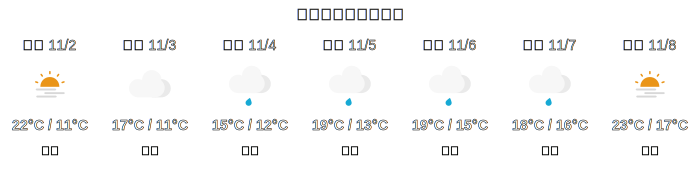

# WeatherPainting 

English | [中文](README_zh.md)




WeatherPainting is a program that uses JavaScript combined with Github workflow to draw a 7-day weather forecast. It automatically refreshes 4 times a day to update weather information.

## So What's the Use?

- You can place it in your Github personal readme just like I did, as shown below


Cool, right? So how do you install it in your readme? Keep reading!

## How to Use?

1. Fork this project and create a Github Page for your forked project (due to Github's security policy, we need to use Github Page to store our generated SVG images)
2. Configure the Github workflow settings in your repository
3. Modify the parameters in src/index.js (labeled with TODO) to your own parameters and commit to Github
4. After both Github Page and Github workflow are configured, add the following code to your readme

```markdown

```
